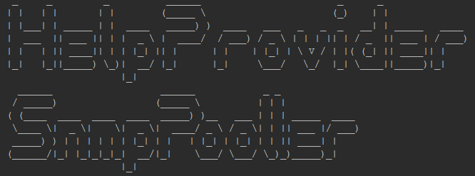

_Текущая версия: v1.0.8_

# Описание
Один из первых модулей серии **HelpProvider**.
Данный модуль реализовует возможность работы с оборудованием по SNMP (**версии v2c**) используя HTTP протокол.   
Он умеет кешировать ответы, обрабатывать запросы пачками и устанавливать лимиты на оборудование, запрос, количество воркеров, время жизни кеша.
  
На данный момент реализована возможность работать используя JSON для передачи данных, в будущем планируется так же CSV для работы с большим количеством запросов.

# Поддерживаемые ОС:  
* Windows
* Linux
* BSD
* Darwin (MAC OS)

# Использование  

### Список методов   
* GET /get
* GET /walk
* GET /bulk_walk
* GET /set
* POST /get
* POST /walk
* POST /bulk_walk
* POST /set
  

###Возможные параметры в запросе:  
   **ip** - IP адрес оборудования   
   **community** - community  
   **oid** - OID запроса(должен начинаться с точки, принимается только нумерованный вариант)  
   **timeout** - время ожидания ответа от оборудования в секундах   
   **repeats** - количество повторных запросов в случае ошибки(игнорируется для set)     
   **type** - (используется при set) тип передаваемого значения(может быть Integer или OctetString)    
   **value** - (используется при set) передаваемое значение, строка или целое число    
   **use_cache** - (игнорируется при set) вернуть ранее полученный ответ от оборудования с кеша(true/1 - да, false/0/не передан - нет)  
_Параметры применимы в GET и POST запросах_    

Структура POST запроса  
``` 
type []Request struct {
	Ip         string `json:"ip"`
	Community  string `json:"community"`
	Oid        string `json:"oid"`
	Repeats    int    `json:"repeats"`
	Timeout    int    `json:"timeout"`
	Type       string `json:"type"`
	Value      string `json:"value"`
	UseCache   bool   `json:"use_cache"`
}
```   
_В POST запросе всегда ожидается лист из snmp-запросов, даже если он один_  


###Структура ответа 
Если статус ответа - HTTP 200 OK, то в теле документа следует ожидать JSON с листом обьектов    
``` 
type Response struct {
	Ip            string          `json:"ip"`
	Error         string          `json:"error"`
	Oid           string          `json:"oid"`
	SnmpResponse  []snmp.SnmpResp `json:"response"`
	FromCache     bool            `json:"from_cache"`
}

type SnmpResp struct {
	Oid      string      `json:"oid"`
	HexValue string      `json:"hex_value"`
	Value    interface{} `json:"value"`
	Type     string      `json:"type"`
}

```   
**Response.Error** - строка с описанием ошибки при опросе оборудования. Если не пустая - ошибка  
**Response.FromCache** - отображает, был ли получен ответ с кеша  
**Response.SnmpResponse.HexValue** - содержит HEX значение Value, байты разделены символом `:`  
В случае ошибки, в Response.SnmpResponse будет находится пустой лист.  


### Живые примеры 
* Запрос через GET
```
curl -X GET \
  'http://localhost:83/get?ip=10.43.127.6&community=public&oid=.1.3.6.1.2.1.1.1.0' \
  -H 'Content-Type: application/json' 
```
* Ответ 
``` 
[
    {
        "ip": "10.43.127.6",
        "error": "",
        "oid": ".1.3.6.1.2.1.1.1.0",
        "response": [
            {
                "oid": ".1.3.6.1.2.1.1.1.0",
                "hex_value": "44:47:53:2D:31:31:30:30:2D:31:30:2F:4D:45:20:56:31:2E:30:31:2E:42:30:37:38",
                "value": "DGS-1100-10/ME V1.01.B078",
                "type": "OctetString"
            }
        ],
        "from_cache": false
    }
]
```

* Запрос через POST  
```
curl -X POST \
  http://localhost:83/walk \
  -H 'Content-Type: application/json' \
  -d '[
    {
        "ip": "10.43.127.7",
        "community": "public",
        "oid": ".1.3.6.1.2.1.1.1"
    },
    {
        "ip": "10.43.127.6",
        "community": "public",
        "oid": ".1.3.6.1.2.1.1.1"
    }
]'
```
* Ответ   
``` 
[
    {
        "ip": "10.43.127.6",
        "error": "",
        "oid": ".1.3.6.1.2.1.1.1",
        "response": [
            {
                "oid": ".1.3.6.1.2.1.1.1.0",
                "hex_value": "44:47:53:2D:31:31:30:30:2D:31:30:2F:4D:45:20:56:31:2E:30:31:2E:42:30:37:38",
                "value": "DGS-1100-10/ME V1.01.B078",
                "type": "OctetString"
            }
        ],
        "from_cache": false
    },
    {
        "ip": "10.43.127.7",
        "error": "",
        "oid": ".1.3.6.1.2.1.1.1",
        "response": [
            {
                "oid": ".1.3.6.1.2.1.1.1.0",
                "hex_value": "44:47:53:2D:31:31:30:30:2D:30:36:2F:4D:45:2F:41:31",
                "value": "DGS-1100-06/ME/A1",
                "type": "OctetString"
            }
        ],
        "from_cache": false
    }
]
```  


